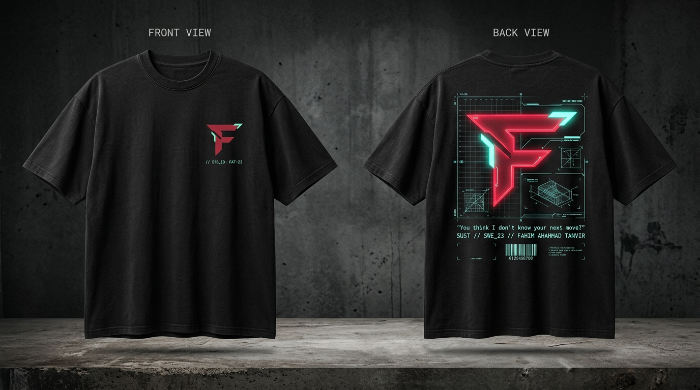
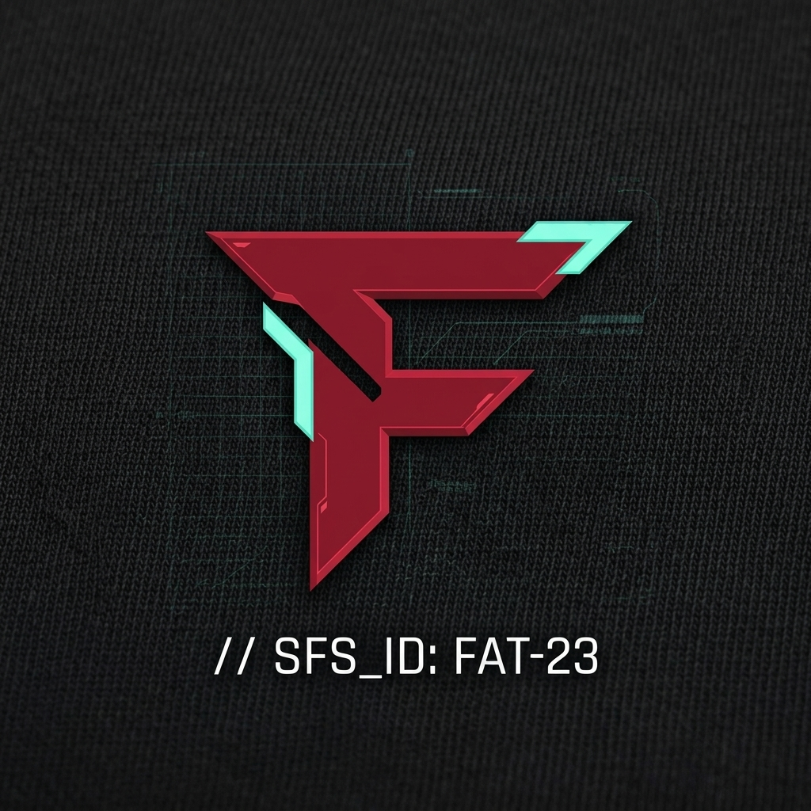

# APPAREL CONCEPT // PROTOCOL: "AGENT ZERO-SIX"
**Custom Cyber-Tactical Streetwear T-Shirt Design**  
*Thematic Fusion: Valorant × Cypher × Full-Stack Software Engineering*

---

## 1. Visual Mockups

### A. Full T-Shirt Concept (Front & Back)


### B. Front Chest Emblem Close-Up (HD Macro Render)


---

## 2. Design Concept & Aesthetic Philosophy

* **Vibe:** Minimalist, Casual, Cyber-Techwear & Streetwear.
* **Inspiration:** Acronym, Cyberpunk 2077 tactical gear, and official Valorant Champions apparel.
* **Core Rule:** **No external third-party logos.** The only brand mark is the custom geometric **"F" Emblem** with the signature mint-cyan tactical notch, accompanied exclusively by architectural HUD elements and your personal developer identity.

---

## 3. Garment Specifications

| Attribute | Specification |
| :--- | :--- |
| **Silhouette** | Boxy Oversized Drop-Shoulder Streetwear Fit |
| **Fabric** | 240 – 260 GSM 100% Combed Compact Cotton / French Terry |
| **Color Base** | Washed Acid Pitch Black (`#080C10` / Vintage Charcoal) |
| **Ribbing** | Heavyweight 1×1 Cotton-Spandex Ribbed Crewneck (2.8 cm width) |
| **Stitching** | Reinforced twin-needle flatlock seams for tactical durability |

---

## 4. Color Palette (Website Synchronized)

* **Base Fabric:** `#080C10` / `#07070F` (Pitch Black / Carbon Void)
* **Primary Accent:** `#FF4655` (Valorant Crimson Red)
* **Secondary Accent:** `#00F5A0` (Neon Mint-Cyan Solder Pip)
* **Technical Details:** `#8A7A62` (Warm Muted Tactical Sand / Cypher Gold)
* **Micro Tech Specs:** `#EAE0D5` (Soft Bone White Monospace)

---

## 5. Front Chest Placement (Minimal & Casual)

* **Position:** Left chest (over the heart), 6.5 cm below the collar.
* **Dimensions:** 5.0 cm width × 4.3 cm height.
* **Design Elements:**
  1. **The Signature "F" Emblem:**
     - Left slanted spine & horizontal fins printed in deep Crimson Red (`#FF4655`).
     - Top-right corner cut features the signature Neon Mint-Cyan Notch (`#00F5A0`).
  2. **Micro Tactical Callout (Right beneath the F):**
     ```text
     // SYS_ID: FAT-23
     LOC: 24.8949° N, 91.8687° E [SUST]
     ```
     *Font:* `Share Tech Mono` (8 pt size, subtle muted sand color).

---

## 6. Back Placement (Hero Statement Blueprint)

* **Position:** Centered across the upper back and shoulder blades (34 cm width × 44 cm height).
* **Composition Breakdown:**
  1. **Center Monolithic "F":**
     - Oversized geometric "F" emblem (16 cm width) with neon dual-tone inner-glow contour.
  2. **Architectural HUD Wireframe:**
     - Delicate technical blueprint gridlines (`0.5 pt` stroke width in cyan/grey).
     - Crosshair targeting reticles at the four corners: `[ + ]`.
     - Technical axis angle markers (`42° CHAMFER // SLANTED VOID`).
  3. **Signature Cypher Quote:**
     ```text
     "You think I don't know your next move?"
     ```
     *Printed in distressed italic tech-mono.*
  4. **Identity & System Specs:**
     ```text
     SUST // SWE_23 // FAHIM AHAMMAD TANVIR
     STATUS: AGENT_ONLINE [🟢]
     STACK: FULL-STACK // COMPETITIVE CODING // ML
     ```
  5. **Tactical Barcode:**
     - Vertical / horizontal high-density barcode ribbon: `0129496700 // PROTOCOL_06`.

---

## 7. Sleeve & Hem Accents (Premium Streetwear Detailing)

1. **Left Sleeve Cuff:**
   - Small woven black label (2 cm × 2 cm) folded over the sleeve ribbing with cyan embroidered brackets: `[SWE]`.
2. **Right Sleeve:**
   - Subtle vertical coordinate print along the forearm seam: `// SWE_SUST_2026`.
3. **Bottom Hem Tag:**
   - Matte black rubberized silicone patch with debossed lettering:
     `[ FAHIM AHAMMAD TANVIR ] — ALL MOVES SECURED`.

---

## 8. Printing & Production Recommendations

* **Primary Emblem (F):** High-Density (HD) Rubberized 3D Puff Print (1.2 mm elevation) for physical tactile depth.
* **Mint-Cyan Notch:** Neon Glow-in-the-Dark Plastisol Ink (charges in ambient light and glows faintly in low light).
* **Blueprint Grid & Text:** Breathable Discharge / Soft-Hand Screenprint (integrates smoothly into the cotton fibers without feeling stiff or heavy).
